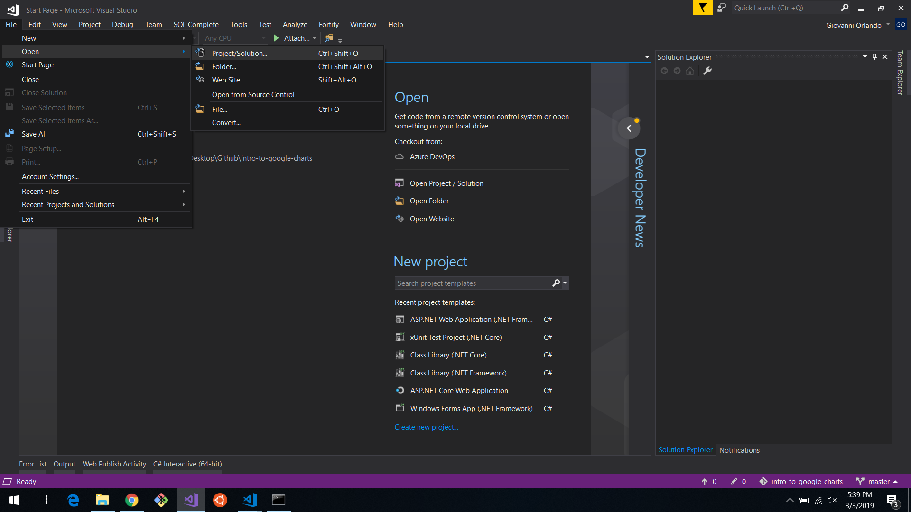
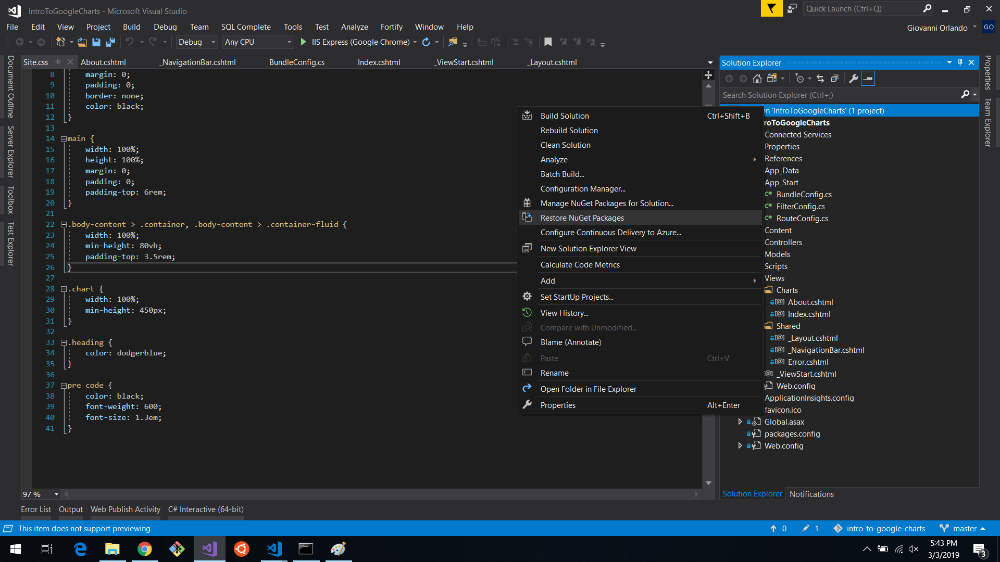
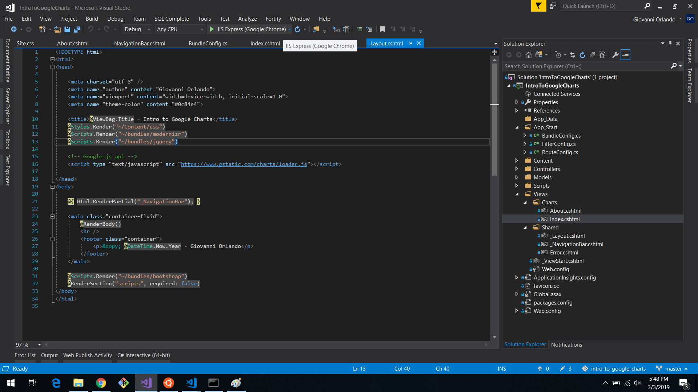

# Introduction to Google Charts
A web application that shows how to use the Google Charts JavaScript library.

# How to install

1. Clone the repository: `$ git clone https://github.com/giovanni0918/intro-to-google-charts.git`
2. Navigate into dir: `$ cd intro-to-google-charts`
3. Open using Visual Studio

4. Restore NuGet packages

5. Start Debugging
